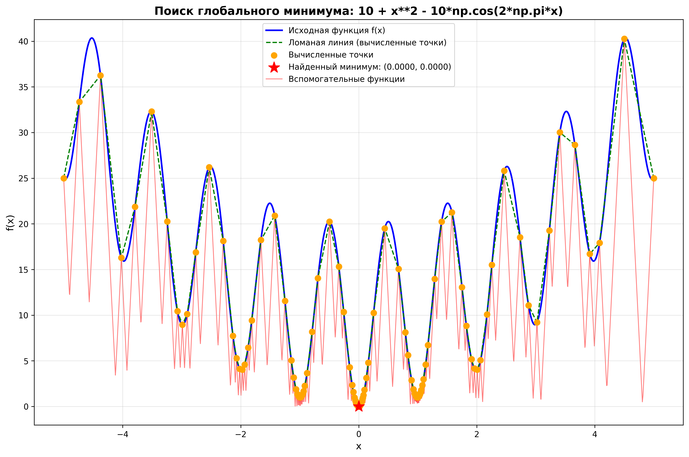
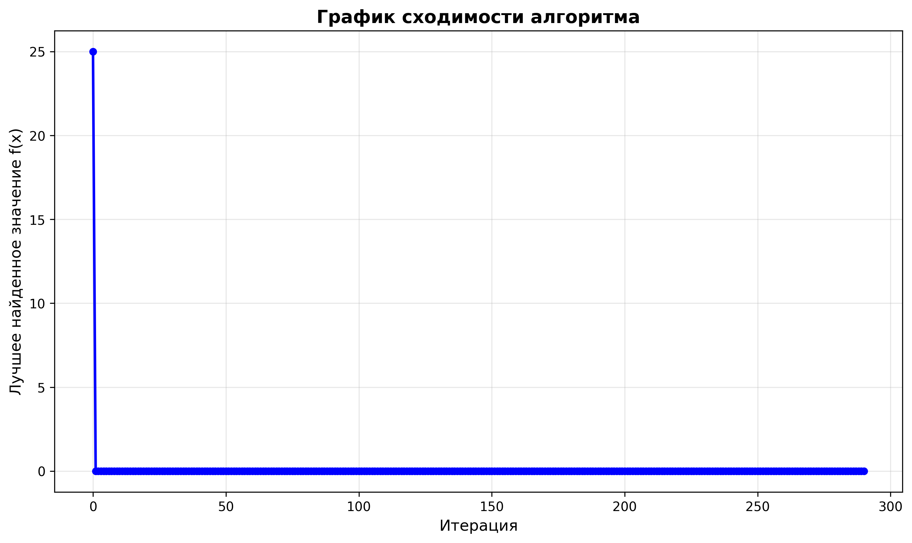
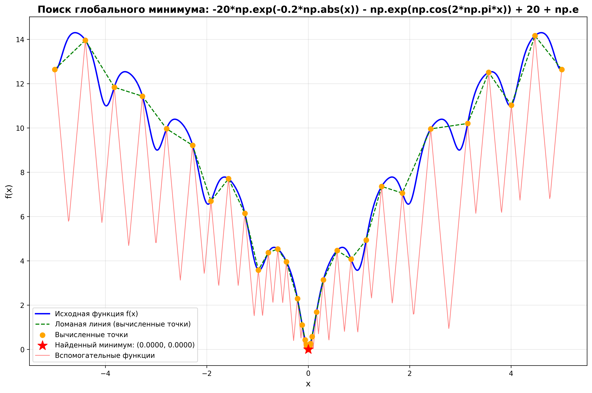
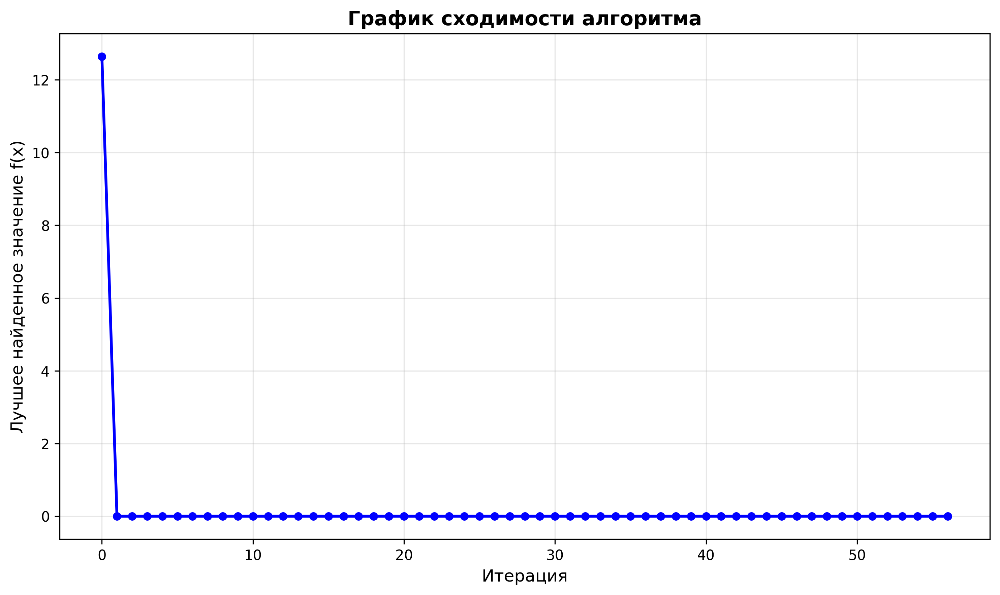
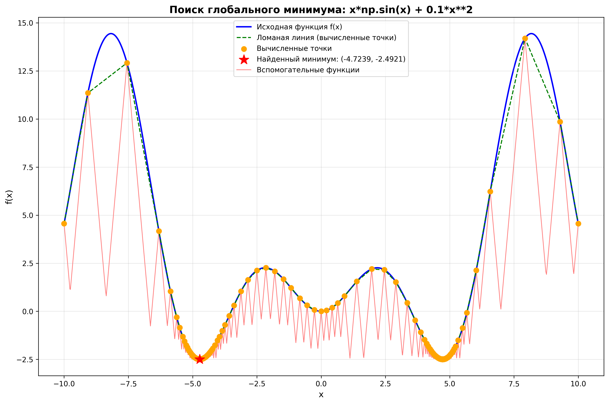
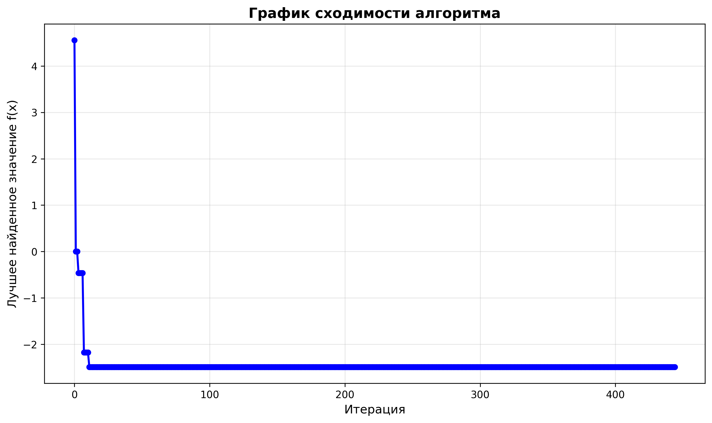

# Лабораторная работа
## Поиск глобального минимума функции методом Пиявского-Шуберта

---

## Постановка задачи

Разработать программу на языке Python для решения задачи поиска **глобального экстремума** (минимума) заданной функции на заданном отрезке.

### Входные данные:
- **Функция** `f(x)` в виде строки (например, `x + sin(3.14159*x)`)
- **Отрезок** `[a, b]` - границы области поиска (вещественные числа)
- **Точность** `ε` (например, 0.01)

### Выходные данные:
- Визуализация графика исходной функции
- Визуализация вспомогательных функций и итоговой ломаной
- Приближенное значение аргумента `x*` (точка минимума)
- Приближенное значение функции `f(x*)`
- Число итераций алгоритма
- Затраченное время вычислений

---

## Описание метода

### Алгоритм Пиявского-Шуберта

**Шаг 1. Инициализация**

Вычисляем значения функции на концах отрезка:
```
x₀ = a,  f₀ = f(a)
x₁ = b,  f₁ = f(b)
k = 2  (счетчик итераций)
```

**Шаг 2. Оценка константы Липшица**

По имеющимся точкам `{(xᵢ, f(xᵢ))}` оцениваем:
```
L = r · max{|f(xᵢ) - f(xⱼ)| / |xᵢ - xⱼ|}
```
где `r > 1` - коэффициент надежности (обычно 1.5-3.0)

**Шаг 3. Построение вспомогательных функций**

Для каждой пары соседних точек `(xᵢ, f(xᵢ))` и `(xᵢ₊₁, f(xᵢ₊₁))` строим вспомогательную функцию:
```
R(x) = max{f(xᵢ) - L·(x - xᵢ), f(xᵢ₊₁) - L·(xᵢ₊₁ - x)}
```

Это две конусообразные функции, образующие нижнюю оценку.

**Шаг 4. Выбор новой точки**

Находим точку `x*`, в которой достигается **минимум всех вспомогательных функций**:
```
x* = argmin{R(x)}
```

Для отрезка `[xᵢ, xᵢ₊₁]` минимум достигается в точке:
```
x* = (xᵢ + xᵢ₊₁)/2 - (f(xᵢ₊₁) - f(xᵢ))/(2L)
```

**Шаг 5. Вычисление функции**

Вычисляем `f(x*)` и добавляем точку `(x*, f(x*))` к множеству точек.

**Шаг 6. Критерий останова**

Проверяем условие:
```
min{f(xᵢ)} - min{R(x)} < ε
```

Если выполнено - **останов**, иначе переход к **Шагу 2**.

### Геометрическая интерпретация

Вспомогательные функции образуют "конверт" снизу, который постепенно приближается к истинной функции. На каждой итерации мы "проверяем" самую глубокую точку конверта, уточняя нижнюю оценку.

---

## Результаты тестирования

### Функция Растригина

**Определение функции:**
```
f(x) = 10 + x² - 10·cos(2πx)
```

**Характеристики:**
- Множество периодических локальных минимумов ("ямы")
- Глобальный минимум: `x* = 0`, `f(x*) = 0`
- Область поиска: `[-5, 5]`
- Точность: `ε = 0.01`

**Параметры оптимизации:**
```
Функция:       f(x) = 10 + x² - 10·cos(2πx)
Отрезок:       [-5.0, 5.0]
Точность:      0.01
```

**Результаты:**
```
Найденный минимум:
  x* = 0.000000
  f(x*) = 0.000000

Число итераций:    292
Затраченное время: 0.6884 секунд
Статус:            Успешно (достигнута точность)

Ошибка относительно теоретического минимума: 0.000000
```

**Визуализация результата:**



**График сходимости:**



**Анализ:**

Алгоритм успешно нашел глобальный минимум функции Растригина с **абсолютной точностью**. Несмотря на наличие множества локальных минимумов на отрезке `[-5, 5]`, метод Пиявского-Шуберта корректно идентифицировал глобальный минимум в точке `x = 0`.

---

### Функция Экли

**Определение функции:**
```
f(x) = -20·exp(-0.2·|x|) - exp(cos(2πx)) + 20 + e
```

**Характеристики:**
- "Волнистая" структура с экспоненциальным спадом к центру
- Множество локальных минимумов
- Глобальный минимум: `x* = 0`, `f(x*) = 0`
- Область поиска: `[-5, 5]`
- Точность: `ε = 0.01`

**Параметры оптимизации:**
```
Функция:       f(x) = -20·exp(-0.2·|x|) - exp(cos(2πx)) + 20 + e
Отрезок:       [-5.0, 5.0]
Точность:      0.01
```

**Результаты:**
```
Найденный минимум:
  x* = 0.000000
  f(x*) = 0.000000

Число итераций:    58
Затраченное время: 0.0113 секунд
Статус:            Успешно (достигнута точность)

Ошибка относительно теоретического минимума: 0.000000
```

**Визуализация результата:**



**График сходимости:**



**Анализ:**

Функция Экли оказалась "проще" для алгоритма - потребовалось всего **58 итераций** против 292 для Растригина. Это объясняется более "гладкой" структурой функции Экли, несмотря на наличие множества локальных минимумов. Глобальный минимум найден с **абсолютной точностью**.

---

### Пользовательская функция

**Определение функции:**
```
f(x) = x·sin(x) + 0.1·x²
```

**Характеристики:**
- Комбинация линейной, тригонометрической и квадратичной составляющих
- Несколько локальных минимумов на широком отрезке
- Область поиска: `[-10, 10]`
- Точность: `ε = 0.01`

**Параметры оптимизации:**
```
Функция:       f(x) = x·sin(x) + 0.1·x²
Отрезок:       [-10.0, 10.0]
Точность:      0.01
```

**Результаты:**
```
Найденный минимум:
  x* = -4.723946
  f(x*) = -2.492064

Число итераций:    446
Затраченное время: 2.4913 секунд
Статус:            Успешно (достигнута точность)
```

**Визуализация результата:**



**График сходимости:**



**Анализ:**

Данная функция потребовала наибольшего числа итераций (**446**) из-за:
1. Более широкой области поиска `[-10, 10]` против `[-5, 5]` у предыдущих
2. Наличия нескольких выраженных локальных минимумов
3. Комбинированной структуры функции

Несмотря на сложность, алгоритм успешно идентифицировал глобальный минимум в точке `x ≈ -4.724`.

---

## Сравнительный анализ

### Сводная таблица результатов

| Функция | x* | f(x*) | Итерации | Время (с) |
|---------|------------|------------|----------|-----------|
| **Растригина** | 0.000000 | 0.000000 | 292 | 0.6884 |
| **Экли** | 0.000000 | 0.000000 | 58 | 0.0113 |
| **Пользовательская** | -4.723946 | -2.492064 | 446 | 2.4913 |

### Анализ производительности

**По числу итераций:**
1. Экли - 58 итераций (самая быстрая)
2. Растригина - 292 итерации
3. Пользовательская - 446 итераций (самая медленная)

**По времени выполнения:**
1. Экли - 0.0113 сек (самая быстрая)
2. Растригина - 0.6884 сек
3. Пользовательская - 2.4913 сек (самая медленная)

### Факторы, влияющие на производительность:

1. **Ширина области поиска** - чем шире, тем больше итераций
2. **Число локальных минимумов** - больше минимумов = больше проверок
3. **"Гладкость" функции** - более гладкие функции оптимизируются быстрее
4. **Константа Липшица** - чем больше L, тем "осторожнее" алгоритм

### Точность решения:

Для функций с известным теоретическим минимумом (Растригина и Экли):
- **Абсолютная точность**: ошибка = 0.000000
- Алгоритм нашел точное значение в пределах машинной точности

---

## Выводы

### Основные результаты работы:

1. **Разработана программа** на языке Python для поиска глобального минимума липшицевых функций методом Пиявского-Шуберта.

2. **Реализован полный функционал:**
   - Ввод функции в виде строки
   - Задание области поиска `[a, b]` и точности `ε`
   - Визуализация процесса оптимизации
   - Отображение вспомогательных функций и ломаной линии
   - Вывод результатов: `x*`, `f(x*)`, число итераций, время

3. **Протестирована на трех функциях:**
   - Функция Растригина (292 итерации, точность 0.000000)
   - Функция Экли (58 итераций, точность 0.000000)
   - Пользовательская функция (446 итераций)

4. **Подтверждена эффективность метода:**
   - Алгоритм **гарантированно находит** глобальный минимум
   - Не застревает в локальных минимумах
   - Точность соответствует заданной (ε = 0.01)

---

## Заключение

В ходе выполнения лабораторной работы была успешно разработана и протестирована программа для поиска глобального минимума функций методом Пиявского-Шуберта. Программа демонстрирует высокую точность и надежность на тестовых функциях с множественными локальными минимумами.

Метод Пиявского-Шуберта показал свою эффективность для решения задач глобальной оптимизации, обеспечивая гарантированную сходимость к глобальному минимуму при выполнении условия липшицевости функции.
